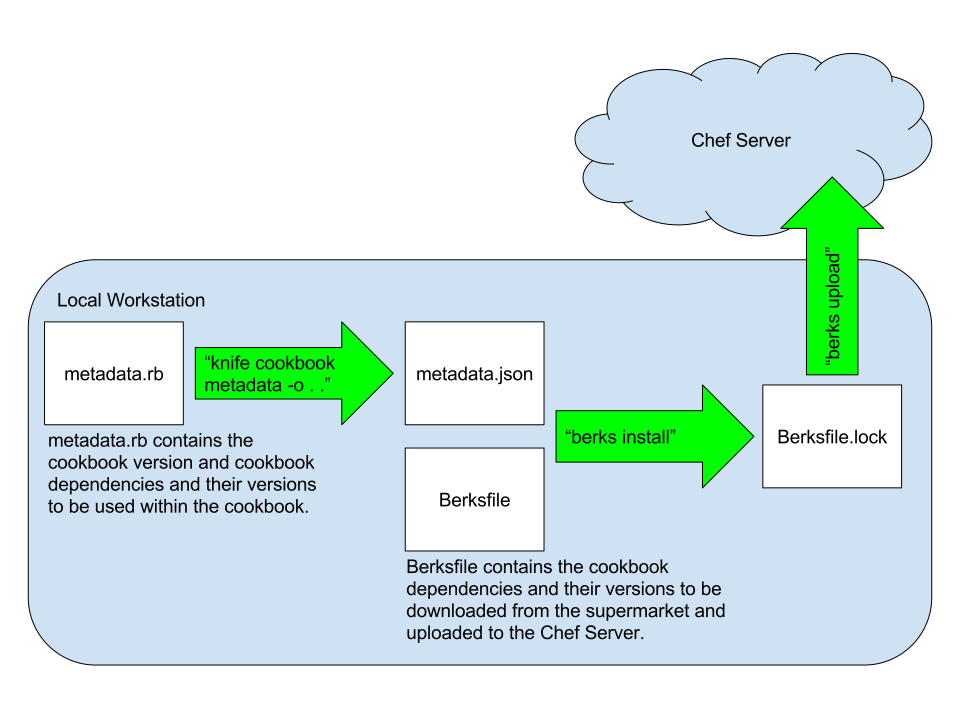

# Chef Cookbook Best Practices

## General

  1. Create a cookbook for every service or application that you have.
  1. Create a "public" recipe for each component of the service or application (app server, db server, etc.).  Though there is no specific notion of public versus private within Chef with regards to the recipes, recipes of this sort are functionally intended to be used from outside the cookbook.
  1. Create "private" recipes for repeatable stuff you want to put in every cookbook (not intended to be exposed to end user, not in run_list of a node, included in other recipes, documented).  Though there is no specific notion of public versus private within Chef with regards to the recipes, recipes of this sort are functionally intended to be used from within the cookbook and are broken out into separate recipes for maintainability of code.
  1. Create data driven cookbooks - Use attributes so the behavior can be changed at runtime.  Databags and encrypted databags can also be used if needed for organization level configuration.  Create an attributes file for each recipe.  Configurable per environment.
  1. Use default recipe so cookbook works out of the box.
  1. Use Supermarket (Library) cookbooks when provisioning with a common feature that has a stable known good Supermarket cookbook.
  1. Use lightweight Wrapper cookbooks which utilize the Supermarket cookbooks.  These wrapper cookbooks contain mostly attribute overrides.
  1. Use custom attributes in a wrapper cookbook instead of using roles.
  1. Lock down cookbook versions per environment using cookbook metadata and berkshelf.
  1. Use Berkshelf to manage third party libraries.
  1. Track changes to cookbook versions at a high level in CHANGELOG.md.
  1. Use `knife cookbook metadata -o . .` from the cookbook's directory to generate metadata.json file from metadata.rb file.
  1. Include the line `metadata` in the Berksfile to include the dependencies from metadata.json.
  1. Use `berks install` from the cookbook's directory to generate the Berksfile.lock from the Berksfile and metadata.json, as well as to download third party dependencies from the Supermarket.
  1. Use `berks upload` from the cookbook's directory to upload the new version of the cookbook and any dependency updates to the Chef server.

## Testing

  1. Embrace test driven development by writing Kitchen tests using ServerSpec before cookbook code is written.
  1. Add tests for complete coverage after cookbook code is written.
  1. Use Kitchen and ServerSpec to test all changes to cookbooks before uploading to Chef server or checking into Git, adding tests for complete coverage.
  1. Use Foodcritic for linting of all changes to cookbooks before uploading to Chef server or checking into Git.

## Source Control

  1. Branch in Git for changes to cookbooks.
  1. Add .kitchen/ and .kitchen.yml to .gitignore
  1. Check in metadata.rb and metadata.json after running `knife cookbook metadata -o . .`
  1. Check in Berksfile and Berksfile.lock after running `berks install`
  1. Set up Continuous Integration for testing of Chef cookbook merge / pull requests.
  1. Git flow is feasible for this work at the cookbook level, but needs to be approached with care from the standpoint of versioning of cookbooks, roles, and environments, as there is a high likelihood of conflicts.

## Style
  1. See [Ruby Style Quality Rules](/languages/ruby/ruby-style-quality-rules.md)
  1. See [Ruby on Rails Guide](/languages/ruby/ruby_on_rails.md)

More Information / References
=============================

  * [The Berkshelf Way ~ Jamie Winsor](http://www.getchef.com/blog/chefconf-talks/the-berkshelf-way-jamie-winsor/)
  * [Berkshelf Site](http://berkshelf.com/)
  * [Getting Started Writing Chef Cookbooks the Berkshelf Way](http://misheska.com/blog/2013/06/16/getting-started-writing-chef-cookbooks-the-berkshelf-way/)
  * [Test Kitchen](https://kitchen.ci/)
  * [ServerSpec](https://serverspec.org/)
