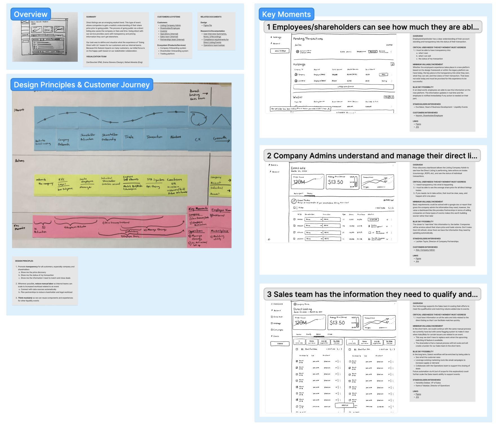

# Visualizing the future of product initiatives as a cross-functional team

* Contents
{:toc}

## Your team needs a product vision
Many teams find themselves on a delivery treadmill. It comes from a good place, like a desire to fulfill customer requests. Over time, the focus on delivery over direction leads to an unclear or absent product vision. 

A lack of vision leads to
* Confusion and inefficiency
* Inconsistent or absent value to the customer
* A disjointed product and customer experience
* Team burnout and frustration

A clear product vision
* Drives alignment and generates excitement from your stakeholders and partners
* Identifies where you need customer validation and helps you get that validation early and fast
* De-risks work and identifies potential roadblocks before committing to expensive product and engineering efforts
* Builds a shared understanding of your product and its value to customers across teams
* Helps you plan and prioritize future efforts

Because teams may not have the time or the support from leadership to go deep on a product vision, we’ve created a process for developing a lightweight visualization of the future centered around a particular initiative or goal.

## Guiding principles for visualizing initiatives
These principles help you stay on track and deliver valuable, well-informed work. 

* **Limit scope**  - Limit the scope and context of your exploration so the work can be done quickly. Rather than creating an all-encompassing product vision, start by visualizing a goal, initiative, or contained slice of the customer experience. 
* **Work collaboratively and socialize everything** - Cross-functional teamwork strengthens your ideas, fosters a sense of ownership, and reduces risk. This helps ensure the vision is well-informed and your learnings don’t get stuck in a silo. No one person should have to carry the weight of the entire process. Share what you’ve learned with stakeholders at regular intervals. Keep the context clear an concise so stakeholders can easily join the conversation.
* **Timebox your efforts** - Estimate how much time it will take to understand the problem, develop potential solutions, and validate them. This can be challenging at first. Setting up time to talk to stakeholders, subject matter experts, and customers can take longer than one might expect. Depending on the experience of the team and the complexity of the problem, the team might be able to work through the process in a few weeks. For complex problems, try to limit the process to a quarter. Your timebox does not have to be rigid, but the team should attempt to adhere to it so that they can move fast. If the process is taking significantly more time than expected, cut scope or limit exploration in order to wrap quickly.
* **Understand the big picture quickly** - The best solutions come from understanding the high-level view of customer needs, workflows, and the product ecosystem. Getting that big picture doesn’t sound like a “small” task, but it is possible to step back and focus on how the pieces of this puzzle relate to each other without going into every detail. Be strategic about where to focus your energy.
* **Focus on value to the customer** - A feature is not inherently valuable. Value comes from whether or not that feature or the experience it’s a part of solves a problem for your customers. Keep customer value in mind while exploring solutions and prioritizing your efforts.
* **Imagine doing more with less** - Part of this process is to imagine what an ideal solution could be. At the same time you have the opportunity to imagine the smallest effort needed to deliver similar value to customers even faster. It might take 6 months to deliver an ideal solution, but what might your solution look like if you had to get it in front of customers tomorrow? Make space to think about opportunities to solve a problem without code.
* **Just enough is better than perfect** - This process creates a “gesture” that describes what a product or service that solves the customer problem *could* be. Aim for a sketch of a compelling story centered on the value your future state provides the user over build-ready designs that cover every edge case. The goal is to have something to share with stakeholders, partners, and customers to learn from. It doesn’t have to be perfect to generate alignment and excitement.

## Putting the principles into action
This next section gives an overview of how our process is shaped by these principles.

There are 4 basic phases 
1. Set the foundation
1. Understand the problem and context
1. Explore key moments with a focus on value to the customer
1. Share the story

Some phases may be very brief. Repeat phases if needed. 

This process may feel familiar. This is a similar process to how we approach discovery: work to understand what’s needed, make prioritized recommendations, validate your ideas, and tell a clear story to get the team aligned. The big difference here is that we’re trying to stay lean and focus most on the value to the customer over what we might potentially build. Software might not be the solution!

### Phase 1: Set the foundation
This is the phase before the work starts. In this phase, you will decide what topic to explore, prepare a team, and estimate the level of detail you think you will need. 

#### Choose a candidate
In an ideal world, you and your team understand your customer’s goals, needs, and pains. You know the opportunities present in your product and the market and how utilizing those opportunities supports your organization’s mission and goals. 

We recognize that not every organization has that customer research to draw from. Instead, you might be working from a recommendation from leadership or coming up with something on your own. If coming up with something on your own, partner with your cross-functional teammates to identify a high-value problem to solve. Product, design, and engineering will all have knowledge and insights. Work together to align on a problem or set of problems to explore. 

Look for problems that are
* High-risk to solve or face potential roadblocks
* Larger than any single team, system, or business vertical
* Stubborn problems past efforts haven’t been able to solve
* Service design or operational problems that involve coordinating efforts outside the product

#### Assemble a team
Our ideal team for vision exploration is a product manager, a design lead, and an engineering lead. They’ll partner with subject matter experts or stakeholders as needed. As long as your team is 2 or more people and has cross-functional points of view represented, you may structure it however works best for your context. Perhaps your team feels like they can’t spare a PM or an eng lead. A past client assembled teams of 2-3 designers who paired with product and engineering once a week. This helped ensure we had all three perspectives represented without a big time commitment from product or engineering. 

Adapt this core team structure to meet your needs. As an example, you may experiment with having two designers on your cross-functional team. In this scenario, one designer acts as a facilitator assisting the team with the process while the other focuses on customer needs and solutions. 

At Lab Zero, design usually drives this process since they are closest to customer needs and often have the rapid prototyping skills necessary to explore ideas quickly. That said, there’s no reason product or engineering can’t be the driver. Product, design, and engineering have many overlapping skills and capabilities. Each individual’s skills and comfort zones will vary. It’s worth having a conversation to decide who drives the work and who will be responsible for what. Use a [RACI matrix](https://www.nngroup.com/articles/ux-roles-responsibilities/) as part of a [norming session](/project_kickoff/team_norms.md) to help determine roles and responsibilities. 

#### Identify your partners
Identify the people you will partner with to understand the context and subject. Book time with them to chat one-on-one. Some examples include:
* Business Owner(s)
* Stakeholders and subject matter experts (SMEs)
* Anyone who has a say in the decision-making process. 

### Phase 2: Understand the problem and context
The goal of this phase is to understand the problem you are trying to solve and the context around it. You will want to know what your team already knosw and where your team needs to learn more to explore potential solutions. 

#### Determine the level of detail
Because this process needs a holistic approach to be successful, tailor the level of detail you’re working with to what you are trying to learn. This allows you to get a broad view quickly and focus on what’s critical to learn. 

* **High-level** - If you are trying to understand the system, work at a high level, focusing on a rough hand-drawn flow sketch or a written scenario. 
* **Detailed View** - If you are trying to understand how the UI can support a better workflow, you might create something more detailed, like a mockup or series of mockups using a design system or a wireframe kit. 

Less detail helps you understand the broader picture faster, more detail helps you address specific localized problems.

#### Go high, go wide
This step helps you quickly get a holistic view of the context, the problem, and the impact solving this problem would have. By the end of this step, you should understand the customer needs this work must address. You should be able to tell the story of the experience today and have an idea of the most critical parts of their journey that you’ll want to explore in the next phase. 

**Activities**
* Learn:
    * Pair with your product partner to review the ask and any existing research or documentation
        * Talk with customers, or if that’s not possible, a well-informed proxy to:
        * Learn the who, what, why, when, and where of the experience
        * Understand customer needs, goals, and pains
    * Talk with stakeholders and cross-functional teammates to understand: 
        * The current product, its workflows, and patterns
        * How competitors solve similar problems or how similar patterns work in other tools

* Create:
    * A broad exploration into the current experience across the complete product ecosystem for all customers (internal and external). This might be: 
        * A journey map or a service map that visualizes how the customer moves through the workflow and what points of friction they encounter
        * Or a written scenario or story 
    * Draft design principles to help guide your explorations
    * Identify opportunities to either generate value for customers or remove friction and roadblocks that prevent customers from seeing value today

Validate with your cross-functional partners that:
* You’ve got the right big picture
* Are addressing the right needs for the right customers
* You are focused on the moments in user experience that are most critical to address when solving the problem

### Phase 3: Explore key moments with a focus on value to the customer
In this phase, imagine potential solutions around the most critical parts of the customer experience. Aim to envision a future state valuable to your customers. Keep in mind that software isn’t always the solution. You have the opportunity to explore these moments from multiple angles.

Activities
* Learn:
    * Pair with your product, engineering, and stakeholder partners to  
        * Get more specific about workflows and potential solutions
        * Understand feasibility and constraints
        * Understand the possibilities to push your ideas further
        * Understand what non-software solutions are possible
* Create:
    * Explore critical workflows, experiences, and/or interfaces in more detail
    * Think through how you might deliver the same value to customers if you were to solve this problem tomorrow. Could you send an email with this information? Could you put a piece of data on the landing page? Could this be a manual process? What’s the least amount of build you can do for customers to see this value quickly?
* Prototype:
    * Remember, the end result *doesn’t* need to be a mockup. You just need something tangible to validate your ideas with users. What that object is and the level of fidelity it needs varies based on what you need to learn. It could be something like
        * A script or scenario might be all that’s needed to understand if a change to the workflow is effective
        * Hand-drawn sketches or wireframed views are valuable for validating the broad strokes of a customer journey 
        * A clickable Figma prototype is helpful when evaluating more detailed UI options
        * A coded prototype (that you’ll discard later) can he helpful for understanding how effective more complex interactions are

Validation
* Test potential solutions with customers, or a well-informed proxy, to confirm your hypotheses around what’s valuable and usable. Take notes and look for opportunities to push your ideas further. Note: If there’s one place to push for talking to real customers, it’s here. You’ll get more valuable insights out of a customer than a proxy during this phase of the process.

### Phase 4: Share the story
This phase is about solidifying a story explaining what you’ve learned and what your team’s recommendations are. 

#### Summarize 

In addition to making the story accessible for your partners to understand, the work you do here gives you an opportunity to validate the visualization one more time. At the end of this step, you should have recommendations ready to socialize and rally the team around. 

Here’s [an example summary](https://www.figma.com/file/kEVk8PaoLbCqI8liK5Emgh/%5BInitiative-Name%5D-Visualization-Summary?type=whiteboard&node-id=0%3A1&t=S06JJImMFlhoq9Ll-1) created for a past client. Your client may have different needs so feel free to modify your summary as needed.

Activities
* Document the problem you are trying to solve and what you’ve learned 
* Summarize design principles that drove your exploration
* Summarize key moments, including
    * A brief overview of what the key moment is
    * The critical need that this moment must solve
    * Options to deliver value to users incrementally, for example:		
        * Could you get value to users quickly by using a manual process or non-software solution? 
        * What might your near-term recommendations be vs. recommendations for a solution you might deliver incrementally over several months? 
    * Links to resources (Figma files, customer interview notes, etc.)

Validation
* Get feedback on the story to ensure it’s clear and engaging to someone who didn’t participate in crafting it. Find where the gaps are and smooth them over. 
* Put the story in front of customers. Get their feedback. See what questions they have and where there are opportunities to push your ideas further so that your solutions are more valuable. 

#### Socialize 
Socializing the visualization is a critical part of the process. If our visualization happens in a vacuum, it will never get turned into action. In this step, tell the story of what you learned and what your ideas for the future are to get your stakeholders and teams excited to learn more and act.

Activities
* Tell the story to leadership, stakeholders, and teams 
* Document and answer questions
* Make recommendations for future iteration, exploration, and/or revision
* Set expectations for the next steps. This might look like: 
    * Pairing with your product partners to get the next steps on the roadmap
    * Partnering with engineering to scope recommendations
    * Aiding in the delivery of that first valuable increment

## Next Steps
Don’t stop there! The visualization process does not result in a ready-to-build design, so there will be work to do to translate the vision into an increment the team will deliver on. As a team, collaborate to determine what recommendations will make it to the roadmap. We expect that product will drive prioritization, and design & engineering will partner on any spikes needed to prepare the ideas for delivery. 

Refer back to the visualization, especially the notes on value to customers, to determine where to push and refine ideas. How might you act on those smallest value increments? What more do you need to learn to turn your recommendations into well-informed designs and clear work for development? Use the visualization to help the team make decisions as you learn more during the delivery process.

## Signals of success
Once you transition to delivering on the first increment of your initiative, there are signals to look out for to help you know if your visualization work is making an impact

* **The team refers back to the visualization** - Listen for it to come up in conversations and working sessions or look for traffic to the documents in Figma or Confluence’s analytics. People will refer to the vision if it is valuable and well-socialized. 
* **Customer perception of product value increased** - Prioritize measuring the outcomes of each increment with customers. This will not only help you make sure you’re working on the right problems but also help you gauge the effectiveness of your increments.   
* **The team perceives the visualization as valuable** - Engage the team the same way you would a customer. Ask for their feedback on the process. What went smoothly? What didn’t? These conversations help you tailor the process to your team’s needs.  

If you’re not hearing these signals or see a decline in usage or perception, it may be time to revisit or retire this visualization. Not all visualizations are meant to be long-lived. Moving on in response to learning something new or having solved the problem is to be expected. Repeating this process with a new initiative gives your team a chance to refine their visualization skills.  

## Tackling the next initiative visualization
When it’s time to create your next initiative visualization, consider swapping out one or more team members so that others at your organization get a chance to contribute and learn these skills. If you had a facilitator, having the same facilitator or a common teammate between efforts will help reinforce the process so the new team doesn’t have to reinvent the wheel each time.

It’s like exercising. The more your team practices creating and executing from initiative visualizations, the easier it will be. Each visualization process lays the foundation for the next one. 

  ## Your feedback is welcome
Have you tried this process or something similar? We want to hear what worked well and what could have gone better so that we may continue to refine and improve. Please get in touch to share your thoughts. 
